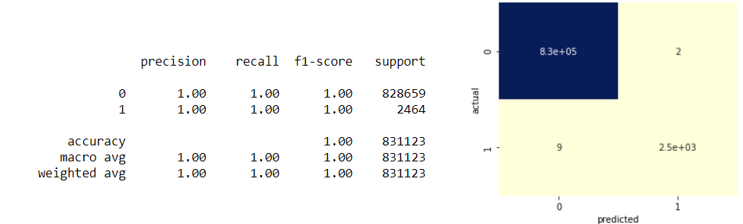

# Building a model for identifying credit card fraud

*As technology has evolved and more people use the internet for transactions, credit card fraud has continually increased. In 2018, worldwide credit card fraud loss was [estimated to be at $24.26 billion](https://shiftprocessing.com/credit-card-fraud-statistics/). Even worse, since the COVID-19 pandemic, credit card fraud has increased even more, [up to 44.7%](https://www.fool.com/the-ascent/research/identity-theft-credit-card-fraud-statistics/). The United States has ranked among the top countries where this occurs.
Companies are continuously searching and improving fraud detection systems. The main crux of the issue is that transactional data tends to be private to a company so improving upon real data must come from within a compnay. Other areas where data is publicly available have more robust solutions to their relative problems. In the case of credit card fraud, synthetic data is often used to help develop models that can work well on real world data. In this project, I create a fraud detection system that helps accurately classify a transaction as fraud/non-fraud and reduce the fraud loss rate.*

## 1. Data

PaySim utilizes aggregated real world data taken from a private dataset to generate synthetic transactional data resembling normal transactions. This real world data is a sample of real transactions extracted from financial logs from a mobile money service implemented in an African country. PaySim was created by Edgar Alonso Lopez-Rojas, Stefan Axelsson, and Ahmad Elmir as part of their Phd theses. Their project goes into the background of creating PaySim and how they approached that. The links to their paper and the data can be found below :

> * [PaySim research paper](https://www.researchgate.net/publication/313138956_PAYSIM_A_FINANCIAL_MOBILE_MONEY_SIMULATOR_FOR_FRAUD_DETECTION)

> * [Kaggle Dataset](https://www.kaggle.com/ealaxi/paysim1)

## 2. Issues with the dataset

The dataset has some challenges on its own. This is in part due to the fact that its synthetic data, and is a challenge that the research paper by Rojas et al. attempts to address. Some of these challenges include:

1. **Imbalanced data:** This is the nature of transactional data, especially when creating a fraud detection system. There will always be data where the amount of non-fraud transactions is much greater than the amount of fraud transactions. It would be worrisome if this wasn't the case! This is addressed with a technique such as undersampling/oversampling. 

2. **Data irregularities:** Looking into the data I saw that there were issues with transaction balances. The difference between the origin amount and destination amount did not match the amount transacted. Additionally, the PaySim system has a column that already flags transactions as fraud but only flags 16 of over 8000 fraud transactions correctly. This may be a product of the fact that this is synthetically created data. I use the balance difference for each transaction as a feature and drop the isFlaggedFraud column.

**The goal** 

The most common strategy in place for identifying potentially fraudulent transactions is to place a limit on the transaction amount; this is what the Paysim system attempts to do. This approach can work but it does have downsides and can be exploited and negatively impact the customer experience. 

In the current dataset, system in place has a fraud loss of just over $12 billion.
In our business scenario, we work for a payment processing company which has identified a major flaw in its technology. Too many of their customers are losing money to fraudulent transactions. Specifically, the system is not catching fraud transactions and thinks a lot of them are legitimate.

The goal is to create a more robust and intelligent classifier to be able to catch these transactions and reduce the fraud loss rate to within market levels. Currently, the system in place is broken so the fraud loss rate per $100 is absurdly high at $1.37, where [companies in the market range from $0.06 to $0.28](https://www.altexsoft.com/blog/credit-card-fraud-detection/).  
This is approached through identifying what features correlate to existing fraud transactions and creating new features from those to help identify new ones.

## 3. Data Cleaning 

In a classification system we pick out a target/feature column in mind, in this case the isFraud column. Then we develop features that would help a model correctly classify the data relative to this target/feature. 

This data didn't require much cleaning. A lot of the issues from above were addressed in the EDA and feature engineering sections. 

## 4. EDA

* We see the frauds only occur from two types of transactions. Reducing our data to these two reduces our heavy imbalance by lowering data size from 6.3 million to 2.7 million transactions. 

* We can also take a look at how fraud occurs depending on the time of day. We see a normal distribution of fraud occuring in the early morning hours. This is used to generate one of the features, which is based on when the transaction occurs. 

## 5. Undersampling and normalization 
Generally with skewed datasets such as the fraud dataset we are working with we run into the issue of imbalanced data. This imbalanced data influences the performance of a ML model. We need to use methods such as undersampling or oversampling so that our model isn't influenced by the highly skewed data.

Undersampling deletes samples from the majority class to try and balance the data. Oversampling duplicates samples from the minority class.

Here we use random undersampling since we have a large amount of the majority data. Random sampling is a simple technique that assumes nothing of the data. There are other methods for undersampling and oversampling that may be used if random sampling is deemed too simple.

Performing feature scaling is really dependent on which ML model you use. In some cases scaling the features can help model performance, in other cases it does not.
Gradient descent based algorithms require features to be scaled, and this is why it is used here with logistic regression and with the gradient boosting model. On the other hand, tree based algorithms are not affected by scaling, this is why it is not used in the random forest model.

## 6. Algorithms & Machine Learning

My approach was to try several different models. A simple dummy classifier, linear regression, decision tree, random forest, and gradient boosting. In my feature engineering section I found that in 99% of fraud transactions, there was a transfer of a certain amount followed by a cash out right after. Normally, when a feature applies to nearly all of the target data uniquely then a model may not be necessary. However, I test the winning model both with and without this feature to see how it affects performance. I find that the model works best with all feaures and removing all features except the 2 important ones and vice versa decreased model performance. 

>***NOTE:** I choose recall as my evaluation metric because the focus of the model is to be able to accurately classify fraud transactions. It would be more detrimental from a business standpoint to classify a fraud transaction as nonfraud than the other way around.*

**WINNER: Random Forest Algorithm**

There are several algorithms we've chosen that have high recall, which is what we were looking for! The top models are:

- The decision tree
- The random forest with undersampling
- The random forest with class weight
- Gradient boosting
All of these have recall accuracy around 99.6% or higher. The difference then falls to precision and computation time. Precision in our case is being able to correctly classify nonFraud transactions so we don't have a situation where a legitimate transaction is blocked because its flagged as fraud by our system. With this in mind, our choices for best model reduce to:

- Random Forest with class weight
- Random Forest with undersampling
- Gradient boosting
The best one here is the random forest with class weight. If we were ignoring precision we could choose gradient boosting since it had a better recall and is computationally less expensive. However, 8% of precision accuracy is more valuable to us than 4 seconds of computation time. Our winning model becomes random forest with class weight.

## 7. Implications
Models can always be optimized. The tradeoff is that tuning parameters using CV algorithms such as GridSearchCV comes with the heavy cost of computation time. There may be parameters that produce much better results than our winning model, however, the decision we make for the business is that those steps need not be taken. The winning model is accurate enough and satisfies our business goals.

The measure we were looking to calculate was fraud loss rate per $100 transacted. Before building our model, our loss rate was $1.37 per $100 transacted. This was several magnitudes worse than industry average. 
A top company like AMEX has a fraud loss rate of 0.06, PayPal has one at 0.28. 
For our model we were able to get a fraud loss rate of 0.0012, which would be a standard in the industry. 

One thing to note however, is that the top companies rank this based on a year basis. The dataset used was limited to a one month period. Additionally, the dataset is synthetic, it would be nice to be able to work using real-world data and with a dataset going furthur back than a month so we can get a more accurate representation of the effectiveness of our model.

## 8. Future Improvements

* In the future, I would love to spend more time addressing the undersampling issue as to why removing undersampling improves the random forest model. 

* This fraud detection system could also be improved by introducing more data to it. I would like to find a way to generate the synthetic data myself to feed into the model and test it. 

## 9. Credits

Thanks to Edgar Alonso Lopez-Rojas for posting his Phd thesis and the dataset onto Kaggle, and Mukesh Mithrakumar for being an amazing Springboard mentor.

